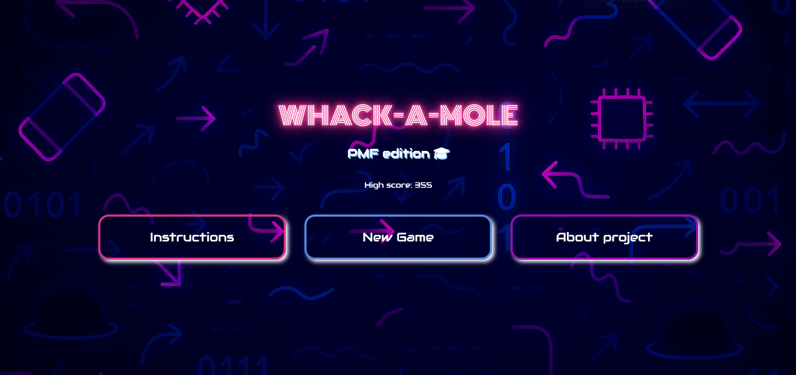
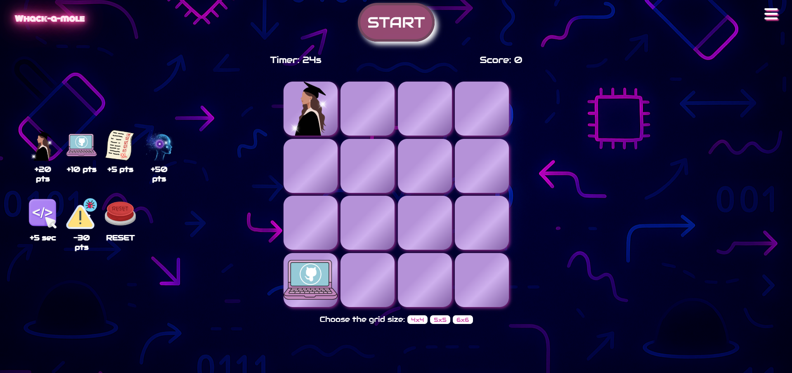

# Whack-a-Mole Game

An interactive browser-based Whack-a-Mole game built with **HTML, CSS, and JavaScript**.

The game was developed as an individual university project for the **Web Programming** course at the **University of Sarajevo – Faculty of Science**.

## Screenshots

| Landing Page | Main Menu |
|---|---|
|  |  |

### Gameplay

## Project Overview

The game is themed around student life and university exams.

The goal is to collect as many points as possible before the timer runs out by clicking different game elements that appear randomly on the board.

Different elements have different effects on the player's score or remaining time.

## Features

- Multiple grid sizes: 4x4, 5x5, and 6x6
- 30-second game timer
- Random appearance of game elements
- Dynamic score updates
- Positive and negative scoring events
- Bonus elements
- Extra-time bonuses
- Sound effects for correct and incorrect clicks
- Instructions and project information pages
- Custom visual design
- Interactive menu and navigation

## Game Rules

Different elements affect the score in different ways:

- Final exam: **+20 points**
- Project: **+10 points**
- Test: **+5 points**
- Bonus item: **+50 points**
- Failed exam: **-30 points**
- Major penalty: resets the score to **0**
- Time bonus: **+5 seconds**

Game elements appear for a limited amount of time and at different frequencies.

## Technologies

- **HTML**
- **CSS**
- **JavaScript**

## Implementation

The project uses JavaScript for:

- game state management
- random element generation
- scoring logic
- timer updates
- user interaction
- dynamic DOM updates
- sound effects

The interface and styling were implemented using HTML and CSS.

## Running the Project

No installation is required.

1. Clone or download the repository.
2. Open `pocetna.html` in a web browser.
3. Click **"Click to play!"** to enter the game menu and start playing.

## About

**Course:** Web Programming  
**Project type:** Individual university project  
**University:** University of Sarajevo – Faculty of Science  
**Academic year:** 2024/2025
